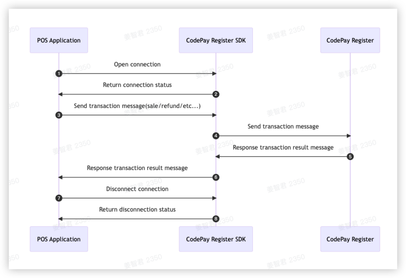

# Register-SDK for Android

Register-SDK Andorid provides a fast connection to CodePay Register via WLAN for POS Application, and provides interfaces for payment, refund, query, etc. for POS Application to call.

## Features

- **Quick Connect**: Register-SDK utilizes mDNS. By starting the SDK, CodePay Register APP can
  quickly discover all POS Application devices. Users can then click on the pairing option to
  establish an automatic connection.

- **Payment**: The SDK offers various payment methods, including code scanning bank cards. It
  provides extensive payment capabilities such as consumption, revocation, refund,
  pre-authorization, pre-authorization completion, and more.

- **Client Manager**: In LAN mode, WiseCashier acts as a Server. The SDK is capable of connecting to
  multiple Servers, and it provides methods to manage these Servers.

## Introduction

### Preparation Before Use

- Android Studio Giraffe | 2022.3.1 Patch 3
- Kotlin 1.3.41
- Gradle 4.2.2
- Java 11
- Android 8.0 (API level 26) and above

### Configuration

1. Add `codepay-register-sdk-android` to the dependencies in your `build.gradle` file.

        dependencies {
            implementation 'com.github.codepay-us:codepay-register-sdk-android:1.0.0'
        }

2. You can use the ecr_sdk module from GitHub as a library module for your app.

## Getting Started

### API Commons

#### 1. Device Discovery and Pairing

> Only WLAN connection mode requires pairing first, USB connection mode does not require pairing.

##### 1.1 Start/Stop Device Discovery Service

The terminal can only discover your POS application when the device discovery service is enabled.
Follow these steps:

- After completing a pairing operation, the terminal and POS application will record each other's network information
- When pairing and connecting to the network are required, the device discovery service needs to be enabled

        import com.codepay.register.sdk.device.ECRHubWebSocketDiscoveryService

        private var mService: ECRHubWebSocketDiscoveryService? = null
        mService = ECRHubWebSocketDiscoveryService(this)

        //start device discover service
        mService?.start(object :ECRHubPairListener {
            override fun onDevicePair(data: ECRHubMessageData?, ip: String?) {
                //When a pairing message is received from CodePayRegister, call back this method
            }
        })
        
        //stop device discover service
        service.stop();

##### 1.2 Get the List of Paired Terminals

- When pushing orders, POS applications can select a device from the list of paired devices.
- When POS applications need to display already paired POS terminals, they can use this function to
  retrieve the list of paired devices for display.

        // Get the list of paired terminals
        mService = ECRHubWebSocketDiscoveryService(this)
        private var mPairedList = mutableListOf<ECRHubDevice>()
        mService?.pairedDeviceList
        
        for (device in mPairedList) {
            // Log the terminal serial number and WebSocket address
            Log.e(TAG, device.terminal_sn)
            Log.e(TAG, device.ws_address)
        }

##### 1.3 Remove Paired Terminal

- When the POS terminal is no longer in use, it can be manually removed from the paired list of the POS application.

        import com.codepay.register.sdk.device.ECRHubWebSocketDiscoveryService
  
        private var mService: ECRHubWebSocketDiscoveryService? = null
        private var mPairedList = mutableListOf<ECRHubDevice>()

        // Remove a paired terminal
        mService?.unPair(mPairedList[0], object : ECRHubResponseCallBack {
            override fun onError(errorCode: String?, errorMsg: String?) {
                // Handle unpairing error
            }
        
            override fun onSuccess(data: PaymentResponseParams?) {
                // Handle unpairing success
            }
        })

#### 2. Connection

Select a paired terminal to initiate a network connection. Once the connection is established, you
can send transaction instructions.

##### 2.1 Call process

##### 2.2 Create Client Instance

WLAN connection mode When a POS application connects to a POS terminal using WLAN, use the following method to create a client

        import com.codepay.register.sdk.client.ECRHubClient
        import com.codepay.register.sdk.client.ECRHubConfig
        
        val config = ECRHubConfig()
        mClient = ECRHubClient.getInstance()
        mClient.init(config, this)

##### 2.3 Connection

Establish the connection from the POS application to the POS terminal.

        // Connecting to the POS Terminal
        mClient.connect("ws://xxxxxx")

##### 2.4 Disconnect

Disconnect the POS application from the POS terminal.

        // This will try disconnect from POS Terminal
        mClient .disconnect();

#### 3. Transaction

###### 3.1 Sale

  1. [Request/Response parameters](https://developer.codepay.me/docs/CodePayRegisterSDK#61-sale)
  2. Example:

        import com.codepay.register.sdk.client.payment.PaymentRequestParams
        import com.codepay.register.sdk.client.payment.PaymentResponseParams
        import com.codepay.register.sdk.listener.ECRHubResponseCallBack
      
        // Build sale request
        val params = PaymentRequestParams()
        params.app_id = "your payment app_id"
        params.merchant_order_no = "12345678"
        params.order_amount = "1.1"
        params.msg_id = "111111"
        params.pay_scenario = "SWIPE_CARD"
        params.confirm_on_terminal = false
      
        mClient.payment.sale(params, object :
        ECRHubResponseCallBack {
        override fun onError(errorCode: String?, errorMsg: String?) {
        //sale fail
        }
      
            override fun onSuccess(data: PaymentResponseParams?) {
                //sale success
            }
        })

###### 3.2 CashBack

1. [Request/Response parameters](https://developer.codepay.me/docs/CodePayRegisterSDK#62-sale-with-cashback)
2. Example:

        import com.codepay.register.sdk.client.payment.PaymentRequestParams
        import com.codepay.register.sdk.client.payment.PaymentResponseParams
        import com.codepay.register.sdk.listener.ECRHubResponseCallBack
        
        // Build cash back request
        val params = PaymentRequestParams()
        params.app_id = "your payment app_id"
        params.merchant_order_no = "12345678"
        params.order_amount = "1.1"
        params.cashback_amount = "1.1"
        params.msg_id = "111111"
        params.pay_scenario = "SWIPE_CARD"
        params.confirm_on_terminal = false
        
        mClient.payment.sale(params, object :
        ECRHubResponseCallBack {
        override fun onError(errorCode: String?, errorMsg: String?) {
        //sale fail
        }
        
            override fun onSuccess(data: PaymentResponseParams?) {
                //sale success
            }
        })

###### 3.3 Void

1. [Request/Response parameters](https://developer.codepay.me/docs/CodePayRegisterSDK#63-void)
2. Example:

        import com.codepay.register.sdk.client.payment.PaymentRequestParams
        import com.codepay.register.sdk.client.payment.PaymentResponseParams
        import com.codepay.register.sdk.listener.ECRHubResponseCallBack
        
        // Build void request
        val params = PaymentRequestParams()
        params.app_id = "your payment app_id"
        params.orig_merchant_order_no = "123322222"
        params.merchant_order_no = "12345678"
        params.msg_id = "111111"
        params.confirm_on_terminal = false
        
        mClient.payment.cancel(params, object :
        ECRHubResponseCallBack {
        override fun onError(errorCode: String?, errorMsg: String?) {
        //void fail
        }
        
            override fun onSuccess(data: PaymentResponseParams?) {
                //void success
            }
        })

###### 3.4 Refund

1. [Request/Response parameters](https://developer.codepay.me/docs/CodePayRegisterSDK#64-refund)
2. Example:

        import com.codepay.register.sdk.client.payment.PaymentRequestParams
        import com.codepay.register.sdk.client.payment.PaymentResponseParams
        import com.codepay.register.sdk.listener.ECRHubResponseCallBack
        
        // Build refund request
        val params = PaymentRequestParams()
        params.app_id = "your payment app_id"
        params.orig_merchant_order_no = "123322222"
        params.order_amount = "1.1"
        params.merchant_order_no = "12345678"
        params.msg_id = "111111"
        params.confirm_on_terminal = false
        
        mClient.payment.refund(params, object : 
        ECRHubResponseCallBack {
        override fun onError(errorCode: String?, errorMsg: String?) {
        //refund fail
        }
        
            override fun onSuccess(data: PaymentResponseParams?) {
                //refund success
            }
        })

###### 3.5 Authorization

1. [Request/Response parameters](https://developer.codepay.me/docs/CodePayRegisterSDK#65-authorization)
2. Example:

        import com.codepay.register.sdk.client.payment.PaymentRequestParams
        import com.codepay.register.sdk.client.payment.PaymentResponseParams
        import com.codepay.register.sdk.listener.ECRHubResponseCallBack
        
        // Build auth request
        val params = PaymentRequestParams()
        params.app_id = "your payment app_id"
        params.order_amount = "1.1"
        params.merchant_order_no = "12345678"
        params.pay_scenario = "SWIPE_CARD"
        params.msg_id = "111111"
        params.confirm_on_terminal = false
        
        mClient.payment.auth(params, object :
        ECRHubResponseCallBack {
        override fun onError(errorCode: String?, errorMsg: String?) {
        //auth fail
        }
        
            override fun onSuccess(data: PaymentResponseParams?) {
                //auth success
            }
        })

###### 3.6 Completion

1. [Request/Response parameters](https://developer.codepay.me/docs/CodePayRegisterSDK#66-completion)
2. Example:

        import com.codepay.register.sdk.client.payment.PaymentRequestParams
        import com.codepay.register.sdk.client.payment.PaymentResponseParams
        import com.codepay.register.sdk.listener.ECRHubResponseCallBack
        
        // Build completion request
        val params = PaymentRequestParams()
        params.app_id = "your payment app_id"
        params.order_amount = "1.1"
        params.merchant_order_no = "12345678"
        params.msg_id = "111111"
        params.orig_merchant_order_no = "123322222"
        params.confirm_on_terminal = false
        
        mClient.payment.completion(params, object :
        ECRHubResponseCallBack {
        override fun onError(errorCode: String?, errorMsg: String?) {
        //completion fail
        }
        
            override fun onSuccess(data: PaymentResponseParams?) {
                //completion success
            }
        })

###### 3.7 Query

1. [Request/Response parameters](https://developer.codepay.me/docs/CodePayRegisterSDK#67-query)
2. Example:

        import com.codepay.register.sdk.client.payment.PaymentRequestParams
        import com.codepay.register.sdk.client.payment.PaymentResponseParams
        import com.codepay.register.sdk.listener.ECRHubResponseCallBack
        
        // Build query request
        val params = PaymentRequestParams()
        params.app_id = "your payment app_id"
        params.orig_merchant_order_no = "12345678"
        params.msg_id = "111111"
        
        mClient.payment.query(params, object :
        ECRHubResponseCallBack {
        override fun onError(errorCode: String?, errorMsg: String?) {
        //query fail
        }
        
            override fun onSuccess(data: PaymentResponseParams?) {
                //query success
            }
        })

###### 3.8 Close

1. [Request/Response parameters](https://developer.codepay.me/docs/CodePayRegisterSDK#68-close)
2. Example:

        // Build close request
        val params = PaymentRequestParams()
        params.app_id = "your payment app_id"
        params.merchant_order_no = "12345678"
        params.msg_id = "111111"
        
        mClient.payment.close(params, object :
        ECRHubResponseCallBack {
        override fun onError(errorCode: String?, errorMsg: String?) {
        //close fail
        }
        
            override fun onSuccess(data: PaymentResponseParams?) {
                //close success
            }
        })